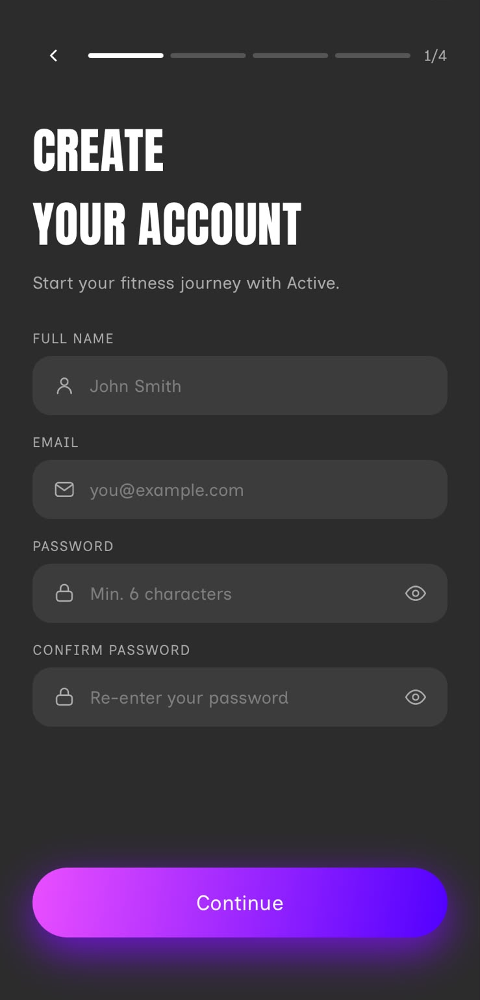
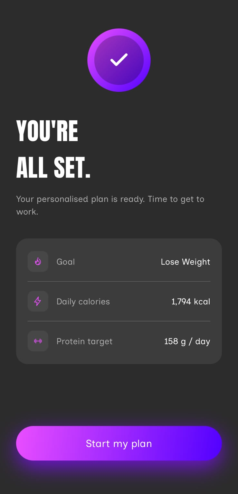
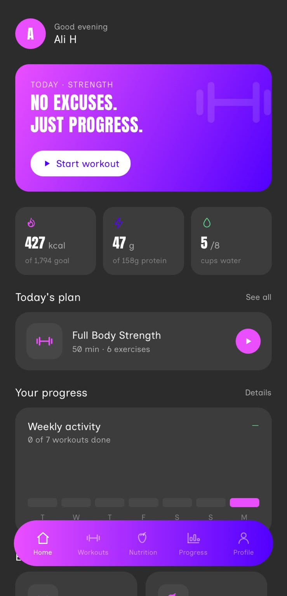
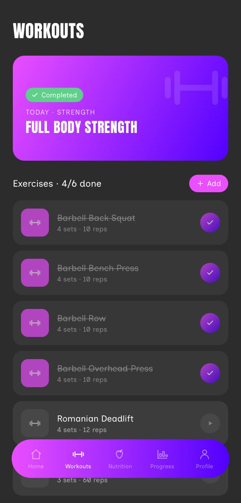
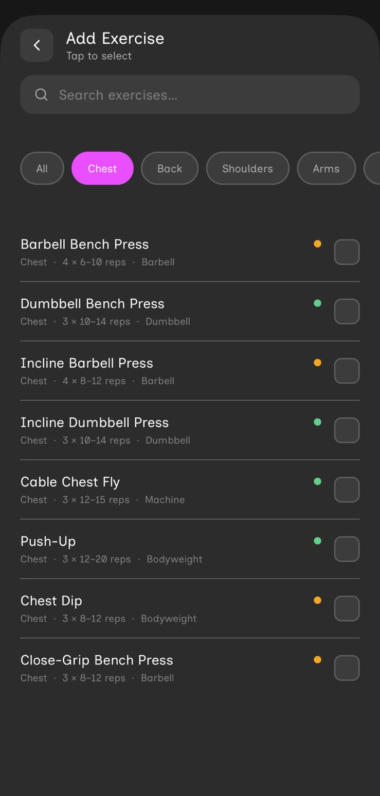
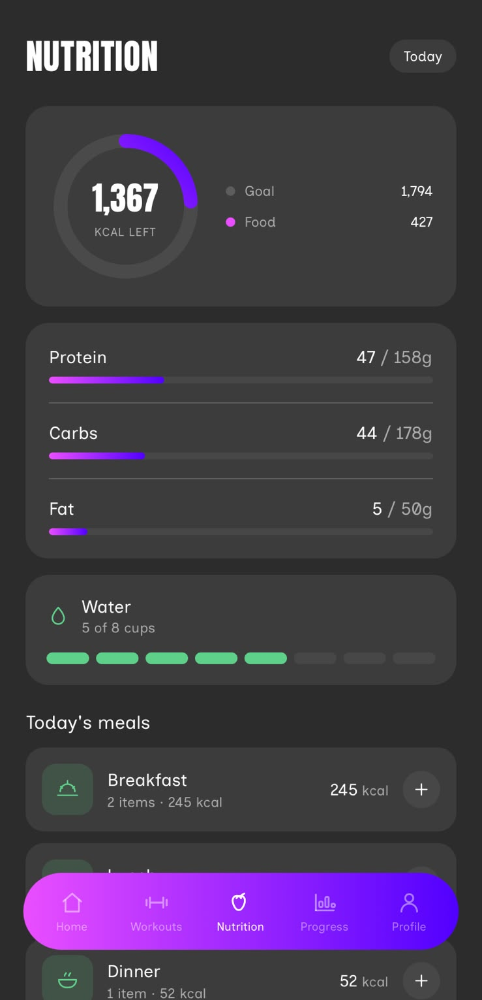
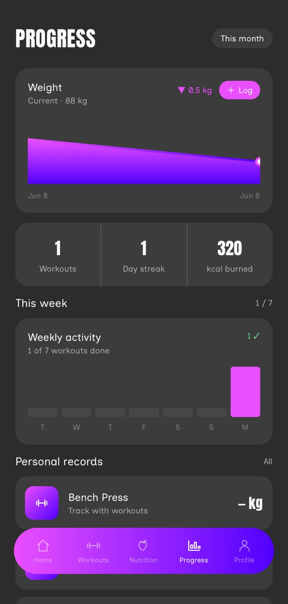
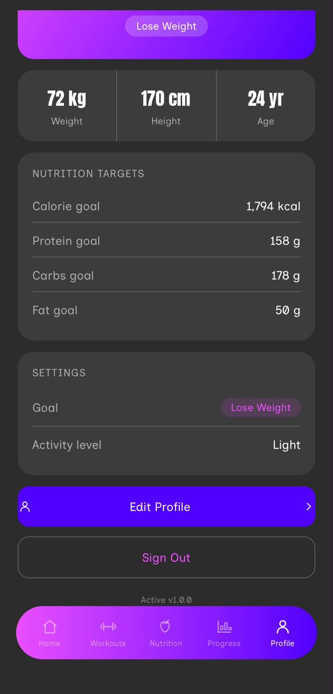

# Active — Fitness Tracking App

A full-featured fitness app built with React Native and Expo. Track workouts, log nutrition, monitor your weight progress, and stay consistent with your goals.

---

## Screenshots

### Onboarding
| Splash | Create Account | Goal & Activity |
|:---:|:---:|:---:|
|  |  |  |

### Main App
| Home | Workouts | Exercise Picker |
|:---:|:---:|:---:|
|  |  |  |

| Nutrition | Progress | Profile |
|:---:|:---:|:---:|
|  |  |  |

---

## Features

**Onboarding**
- Account creation with name, email, and password confirmation
- Gender, age, height, and weight collection
- Goal selection (Lose Weight, Build Muscle, Stay Fit) with activity level
- Automatic TDEE and macro calculation using Mifflin-St Jeor BMR

**Workouts**
- Daily workout plan auto-generated based on your goal and day of the week
- Start, track, and finish workout sessions
- Toggle individual exercises as complete
- Add custom exercises via the Exercise Picker (filter by muscle group, search by name)

**Nutrition**
- Daily calorie and macro tracking (protein, carbs, fat)
- Log meals across Breakfast, Lunch, Dinner, and Snacks
- Food search across 85+ items in 7 categories
- Water intake tracking (cup counter)
- Real-time calorie ring and macro progress bars

**Progress**
- Weight log with SVG trend chart
- Workout streak and total session stats
- Weekly activity bar chart
- Personal records section

**Profile**
- View and edit body stats, goal, and activity level
- Macros and calorie targets recalculate on save
- Sign out with confirmation

---

## Tech Stack

| Layer | Technology |
|---|---|
| Framework | React Native 0.81 + Expo SDK 54 |
| Language | TypeScript 5.9 |
| Navigation | React Navigation v7 (native-stack + bottom-tabs) |
| Backend | Firebase v12 (Auth + Firestore) |
| Fonts | Anton (display), Inclusive Sans (body) via Google Fonts |
| Charts | react-native-svg |
| Gradients | expo-linear-gradient |

---

## Project Structure

```
src/
├── components/       # Shared UI (AppHeader, Icon library)
├── config/           # Firebase initialisation
├── constants/        # Colors, fonts, spacing, gradients
├── data/             # Static exercises and food items
├── hooks/            # useAuth, useUserProfile, useDailyLog, useWeeklyActivity, …
├── navigation/       # MainNavigator (tabs), MainStackNavigator (modals)
├── screens/
│   ├── onboarding/   # Splash → Login/CreateAccount → Gender → AboutYou → Goal → Done
│   └── main/         # Home, Workouts, ExercisePicker, Nutrition, FoodSearch, Progress, Profile
├── services/         # authService, userService, workoutService, nutritionService, …
└── types/            # Shared TypeScript types
```

---

## Getting Started

### Prerequisites

- Node.js 18+
- Expo CLI (`npm install -g expo-cli`)
- A Firebase project with **Authentication** (Email/Password) and **Firestore** enabled

### 1. Clone and install

```bash
git clone <repo-url>
cd active-fitness-app
npm install
```

### 2. Configure Firebase

Create `src/config/firebase.ts` with your project credentials:

```ts
import { initializeApp } from 'firebase/app';
import { initializeAuth, getReactNativePersistence } from 'firebase/auth';
import { getFirestore } from 'firebase/firestore';
import AsyncStorage from '@react-native-async-storage/async-storage';

const firebaseConfig = {
  apiKey: '...',
  authDomain: '...',
  projectId: '...',
  storageBucket: '...',
  messagingSenderId: '...',
  appId: '...',
};

const app  = initializeApp(firebaseConfig);
export const auth = initializeAuth(app, {
  persistence: getReactNativePersistence(AsyncStorage),
});
export const db = getFirestore(app);
```

### 3. Set Firestore Security Rules

In the Firebase Console → Firestore → Rules:

```
rules_version = '2';
service cloud.firestore {
  match /databases/{database}/documents {
    match /users/{userId}/{document=**} {
      allow read, write: if request.auth != null && request.auth.uid == userId;
    }
  }
}
```

### 4. Run the app

```bash
npm start          # Expo dev server
npm run android    # Android emulator
npm run ios        # iOS simulator (macOS only)
```

---

## Firestore Data Model

```
users/{uid}
  ├── displayName, email, gender, weightKg, heightCm, age
  ├── goal, activityLevel
  ├── calorieGoal, proteinGoalG, carbGoalG, fatGoalG
  │
  ├── dailyLogs/{YYYY-MM-DD}
  │     ├── caloriesEaten, waterCups, workoutCompleted
  │     └── meals: { breakfast: [], lunch: [], dinner: [], snacks: [] }
  │
  ├── workoutSessions/{id}
  │     ├── date, programName, durationMinutes, completed
  │     └── exercises: [{ name, sets, reps, weightKg, completed }]
  │
  └── weightLog/{id}
        ├── date
        └── weightKg
```
